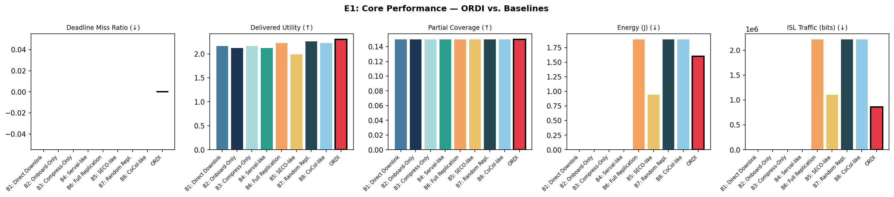

# ORDI

**Orbit-Aware Redundant Distributed Inference for LEO Earth Observation Constellations**

ORDI is a scheduling research prototype for distributing tiled Earth-observation inference workloads across low-Earth-orbit satellites. It runs as a policy on Basilisk/BSK-RL, using orbit-aware contact graphs, satellite resource state, and selective fault-disjoint replication to improve deadline performance without the cost of replicating every task.

The repository includes ORDI, five core comparison policies, a random-placement control, fault injection, four focused evaluations, plotting utilities, and the accompanying paper.



## Approach

ORDI schedules each image tile over a rolling horizon. For every epoch it:

1. Builds feasible source-helper-aggregator routes from a time-expanded orbital contact graph.
2. Accounts for compute rate, battery, temperature, queue state, availability, latency, and link reliability.
3. Selects a primary assignment by marginal utility and communication congestion; policies do not estimate joules.
4. Adds backups up to a configurable cap only while their marginal reliability gain exceeds their replication cost, while keeping replicas fault-disjoint. Correlated fault-domain risk is learned online with a discounted Jeffreys-prior Beta–Bernoulli estimator from actual primary deliveries, backup recoveries, and hard assignment failures. Seeded Thompson sampling balances backup exploration against cost, with one exploratory backup allowed until three assignment outcomes establish a minimal sample; idle healthy planes and contact/queue misses are not fault samples. The scheduler is not given the injector's error rate. The default cap is one backup.
5. Replans work affected by helper failures, missed contacts, or stragglers.

Basilisk/BSK-RL models the spacecraft environment. ORDI retains workload generation, contact-graph construction, bandwidth allocation, store-and-forward routing, and seven classes of injected faults.

## Reference Architecture and Scope

ORDI does not claim that E1 reproduces one existing operator's deployed
constellation. It uses a composed, traceable reference architecture:

| Layer | Reference |
| --- | --- |
| EO payload and image model | [PlanetScope/SuperDove](https://science.nasa.gov/earth-science/csda/vendor-planet/) |
| ISL and distributed compute model | [Kepler Tranche 1](https://kepler.space/kepler-deploys-first-space-based-scalable-cloud-infrastructure-powered-by-nvidia/) |
| Fault-tolerant sensing/transport topology | [SDA PWSA](https://www.sda.mil/home/about-us/faq/) |
| Autonomous EO scheduling concept | [ESA TASCNET](https://incubed.esa.int/portfolio/tascnet/) |

We evaluate a notional next-generation EO constellation combining
PlanetScope-class multispectral imagers with a Kepler-class optical
edge-compute fabric. This architecture reflects emerging ESA TASCNET and
[FireSat/Muon](https://www.muonspace.com/press/muon-space-to-integrate-spacexs-starlink-mini-space-lasers-into-its-halo-tm-satellite-platform)
concepts but does not claim to reproduce an existing operator's deployed
system. The absence of a complete operational civilian EO compute mesh is the
research gap ORDI addresses.

## Requirements

- Python 3.11
- [uv](https://docs.astral.sh/uv/)
- Optional: [Task](https://taskfile.dev/) for the shorthand commands below

## Setup

Install the locked dependencies:

```bash
uv sync
```

With Task installed, the equivalent command is:

```bash
task setup
```

Verify that the experiment modules import successfully:

```bash
task check
```

## Running Experiments

Run an individual experiment:

```bash
task e1
```

Or invoke the Python entry point directly:

```bash
uv run python -m ordi.main run E1
```

To measure scheduler headroom without changing the production algorithms, run
the exact reduced-instance oracle:

```bash
uv run python -m ordi.eval.oracle --seeds 8
```

It exhaustively searches admission, ordering, and the six best unsplit routes
for four requests under the shared compute/contact feasibility model. Results
are written to `results/oracle_gap.csv`; the bound is exact for this declared
reduced action space, not for full E1.

The more comprehensive stochastic oracle adds multiple release epochs,
persistent resource ledgers, optional fault-disjoint backups, and matched
plane/helper/ISL fault scenarios:

```bash
uv run python -m ordi.eval.stochastic_oracle --seeds 8
```

Its expected-utility and deadline-miss gaps are written to
`results/stochastic_oracle_gap.csv`.

Available evaluations are:

| ID | Evaluation |
| --- | --- |
| E1 | PlanetScope-class ROI placement on a scaled 3×12 optical compute mesh with 10 GS and 2% matched random faults |
| E2 | E1 setup with random-fault intensity swept |
| E3 | E1 setup with random faults replaced by correlated orbital-plane failures |
| E4 | E1 3×12 constellation with nominal load swept across 20, 40, 60, and 80 requests/orbit |

The former real-data case is excluded until its removed Skyfield/TLE path is
replaced by Basilisk propagation; it is not advertised as runnable in the
meantime.

Run the full evaluation suite and generate every plot:

```bash
task all
```

The focused suite uses eight matched seeds for every experiment. E4 keeps the
36-satellite E1 constellation fixed and varies only request load. To run or
plot all experiments without Task:

```bash
uv run python -m ordi.main run all
uv run python -m ordi.main plot all
```

Experiment CSV files are written to `results/`. Generated plots are written to `figure/`.

## Orbit Propagation

Eclipse, power, battery, thermal, and spacecraft availability state are
simulated by Basilisk 2.11 through the BSK-RL multi-satellite environment.
Skyfield/SGP4 generates the contact and acquisition windows from the same
Walker elements, epoch, ground stations, and elevation mask passed to Basilisk;
the two backends therefore describe one synchronized constellation. ORDI is an
ordinary scheduling policy: it consumes BSK-RL/Basilisk state and owns tile
placement, redundancy, bandwidth allocation, and store-and-forward routing.
Compute, ISL transmit/receive, and downlink workloads drive Basilisk power
nodes; reported workload energy comes from those nodes rather than from policy
metadata. Communication loads retain the shared contact ledger's absolute
start/end times, so future and multi-epoch transfers draw power only while
their reserved hops operate. Basilisk's measured temperature is projected to
accelerator capacity with a pre-throttle region over the final 10 C below the
configured safety limit, while the battery reserve and temperature limit
control availability.

On first use Basilisk downloads its official support data (gravity and SPICE
ephemerides) through `pooch`; set `BSK_SUPPORT_DATA_CACHE` to a writable shared
directory in CI or on a cluster.

## Repository Layout

```text
ordi/
├── algorithms/  # Basilisk-facing policies with one shared schema
├── orbit/       # Contact-window construction and time-expanded graphs
├── sim/         # Basilisk adapter, projected state, reliability, measurements
├── tasks/       # EO task generation and workload profiles
├── faults/      # Fault models and injection
└── eval/        # Experiments, metrics, CSV output, and plotting
figure/          # Generated evaluation figures
paper/           # LaTeX source and compiled paper
research_plan.md # Original system and evaluation plan
Taskfile.yml     # Reproducible development and experiment commands
```

## Paper

The paper is available as [paper/main.pdf](paper/main.pdf), with its LaTeX source in `paper/main.tex` and bibliography in `paper/references.bib`.
